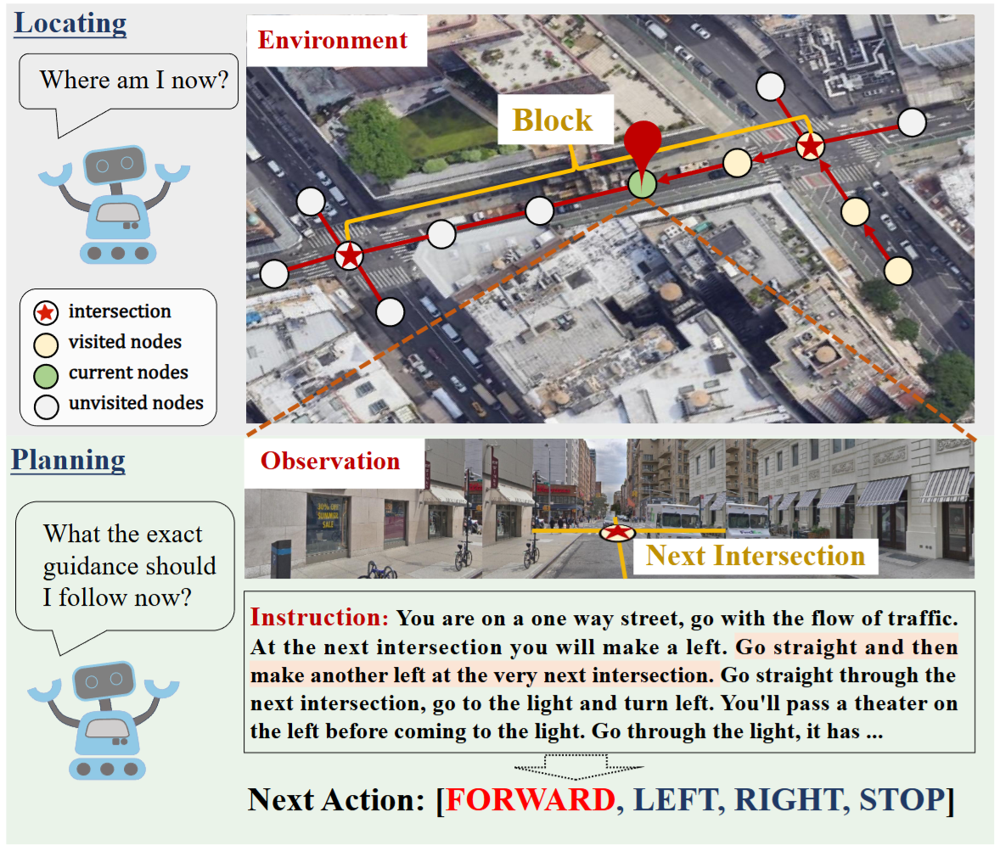
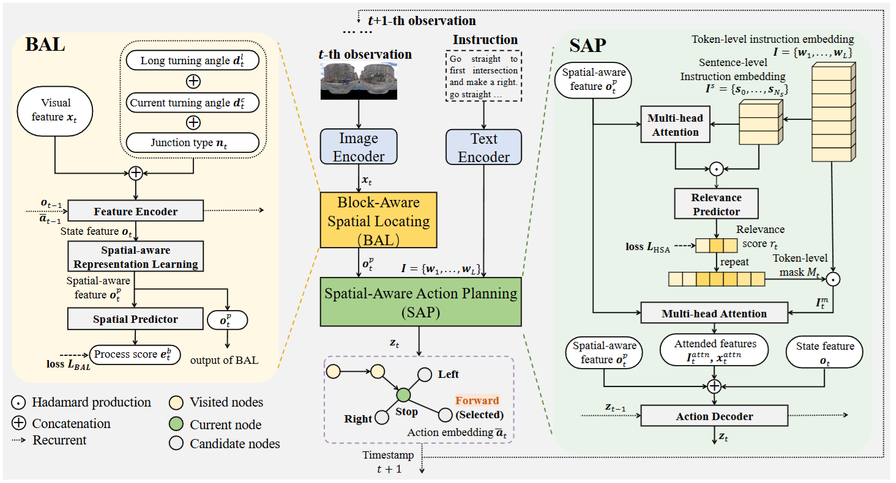

# Loc4Plan: Locating Before Planning for Outdoor Vision and Language Navigation
(ACM MM 2024) This is a pytorch implementation for paper "Loc4Plan: Locating Before Planning for Outdoor Vision and Language Navigation".
## Outdoor Vision and Language Navigation (VLN) task

Vision and Language Navigation (VLN) requires agents to understand instructions and navigate to the destination in a visual environment. 

One of the *key challenges* in outdoor VLN is keeping track of which part of the instruction was completed.



## Our Framework



## Requirements

```
pip install -r requirements.txt
```

## Data preparation

Unfortunately we are not allowed to share the panorama images or the ResNet features derived from them. You have to request to download the images here: https://sites.google.com/view/streetlearn/dataset 

Then change into the `panorama_preprocessing/last_layer` or `panorama_preprocessing/fourth_layer` folder and use the `extract_features.py` script. 

## Training and Evaluating Loc4Plan
Training:
```bash
bash train.sh
```
Evaluating:

```bash
bash test.sh
```

The `path_to_features_dir` should contain the `resnet_fourth_layer.pickle` and `resnet_last_layer.pickle` file created in the pano preprocessing step.

# Citation

If our paper is useful for your research, please consider citing it:
```text
@inproceedings{tian2024loc4plan,
  title={Loc4plan: Locating before planning for outdoor vision and language navigation},
  author={Tian, Huilin and Meng, Jingke and Zheng, Wei-Shi and Li, Yuan-Ming and Yan, Junkai and Zhang, Yunong},
  booktitle={Proceedings of the 32nd ACM International Conference on Multimedia},
  pages={4073--4081},
  year={2024}
}
```

## Acknowledgements

Code based on [raphael-sch/map2seq_vln](https://github.com/raphael-sch/map2seq_vln). 
Touchdown splits based on: https://github.com/lil-lab/touchdown
map2seq splits based on: https://map2seq.schumann.pub
Panorama images can be downloaded here: https://sites.google.com/view/streetlearn/dataset

Thanks for their great work. 

We also hope our source code can help people who are interested in our work or the vision and language navigation task. If you have any questions about our paper or the codes, please feel free to open an issue or contact us by email.